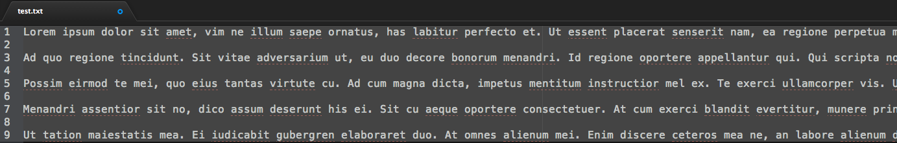
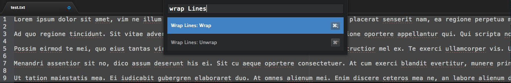
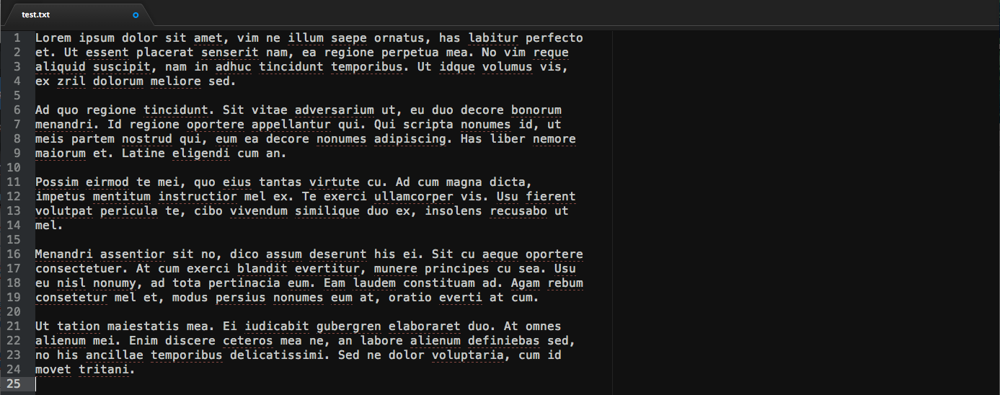

# wrap-lines package

This is a simple module to wrap lines like 'gq' in Vim.

Command ; wraps lines to 80 characters on word boundaries

Command ' unwraps lines

You can highlight multiple paragraphs as well.

It is just a quick implementation -- I'm sure much could be improved on, but it works for now.

